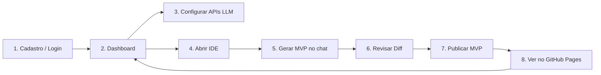
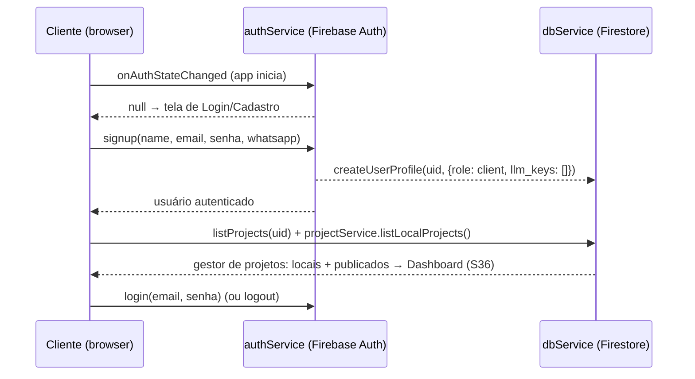
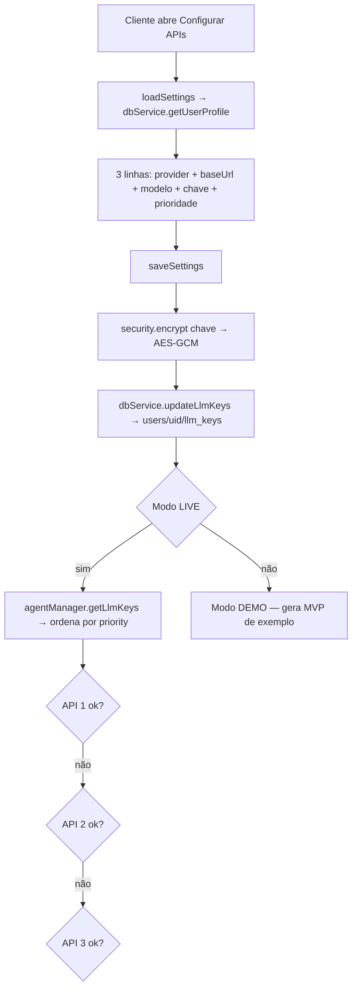
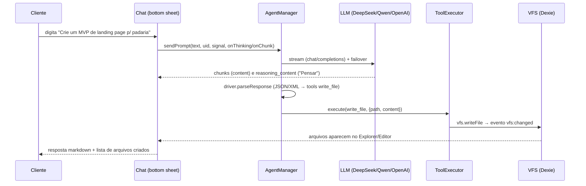
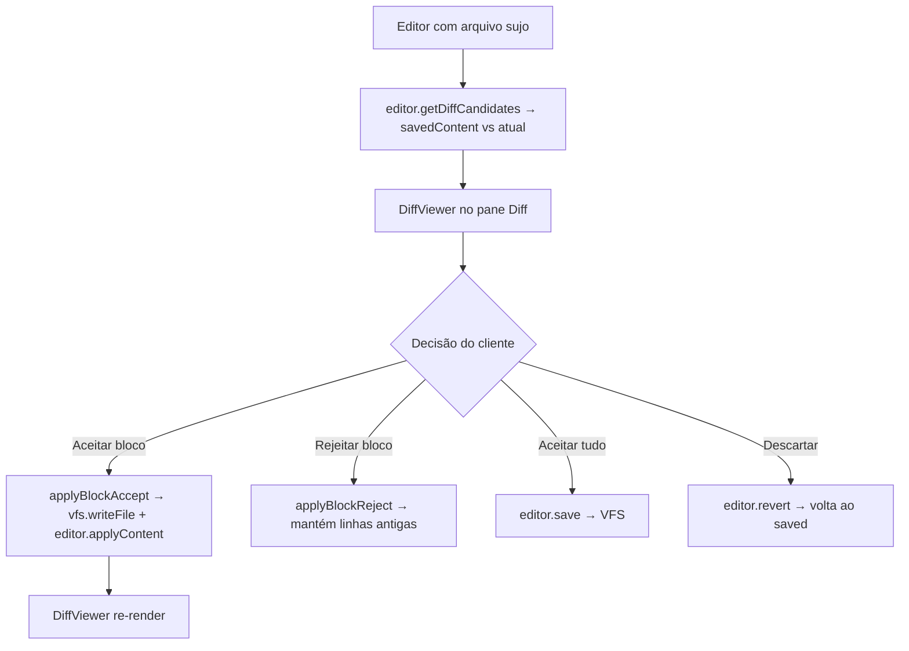
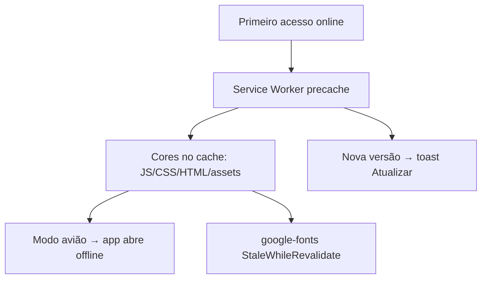

# CAIM — Jornada do Cliente (MVP Factory)

> Mapeamento completo dos fluxos na perspectiva do cliente. As **sprints de homologação (S13–S19)** que testam cada fluxo estão em `../implementation.md` (Fase 5).
> Legenda: ✅ implementado · 🔒 depende de ação do Owner (secret/seed) · 🔮 futuro

---

## J0 — Visão Macro da Jornada



**Lógica de negócio:** o cliente usa as **próprias chaves de LLM** para gerar o código; o deploy acontece na **conta do Owner** via Cloud Function (PAT do Owner nunca sai do Secret Manager). O cliente só vê o resultado (URL + histórico no dashboard).

---

## J1 — Autenticação & Onboarding (auth-gate)



**Rota de segurança:** `firestore.rules` garante `users/{uid}` só o dono; `config/{key}` (cofre) só `role == 'owner'`.

---

## J2 — Configuração de APIs de LLM (failover)



**Regras:** até 3 chaves ativas; failover em 401/429/5xx (backoff 1,2s em 429/5xx); timeout 120s; "Parar" aborta o fetch. **S14 (16/08):** reabrir Configurações preserva as chaves cifradas sem redigitar; chaves nunca em texto puro (AES-GCM); coberto por testes (`agent-manager.test.js`, `auth-views.test.js`).

---

## J3 — Geração do MVP (chat → agente → arquivos)



**Contexto (S7):** `editor.getOpenFilesContext()` injeta até 3 arquivos abertos no system prompt (cap 8KB). Histórico do chat persiste no VFS (60 msgs).
**Truncamento (S15):** se o modelo cortar a resposta no meio de uma tool call (limite de tokens), o parser **salva o arquivo parcial** e o chat exibe "⚠ Resposta truncada — reenvie o prompt" (`detectTruncation` — testes verdes, 16/08).
**Failover (S14):** chave 1 com 401 → cai na 2; chave 2 com 429 → backoff → cai na 3; chave desativada é ignorada (`getLlmKeys` filtra `active`).

---

## J4 — Revisão (Diff)



**Filtro:** `.min.*`/`.map` ignorados (`isMinifiedFile`).

---

## J5 — Publicar MVP (deploy via Cloud Function)

```mermaid
flowchart TD
    C[Cliente clica Deploy no header ou no Git pane] --> P[deployProject]
    P --> T[authService.getIdToken]
    P --> F[empacota VFS: files path+content]
    P --> CF[POST githubDeployProxy + Bearer token]

    subgraph CloudFunction ["githubDeployProxy (conta do Owner)"]
        V[verifyIdToken] --> S[Secret Manager → GITHUB_OWNER_PAT]
        S --> O[octokit: cria repo mvp-<data>-<rand>]
        O --> G[Contents API: cria commit inicial + escreve/atualiza arquivos]
        G --> PG[createPagesSite branch main]
    end

    CF --> R[URL https://owner.github.io/<repo>]
    R --> DB[dbService.addProject → projects/{uid}]
    R --> LS[projectService: snapshot + markDeployed → badge 🚀 publicado]
    R --> TO[Toast persistente + botão Abrir (S36b)]
    DB --> DASH[Dashboard lista o MVP]
    LS --> DASH
```

**Regra de ouro:** o PAT do Owner **nunca** existe no frontend; tudo passa pela CF autenticada com o ID token do cliente.
**Hardening (16/08):** `gitCorsProxy` com **host-allowlist** (só GitHub) + **rate limit 50 req/min** por uid autenticado ou IP — **DEPLOYADO** (verificado: GitHub → 200, host externo → 403).
**Deploy atual (16/08):** o `githubDeployProxy` usa a **Contents API** (`createOrUpdateFileContents`) — a Git Data API retorna `409 Git Repository is empty` em repos recém-criados sem nenhum commit. Validado por E2E real (`diag-e2e.cjs`).
**Feedback pós-deploy (S36b):** o toast de sucesso agora é **persistente** ("MVP publicado! Ficou salvo no dashboard." + botão "Abrir"); o `404` no console durante o build é esperado (HEAD do `waitForPagesLive` enquanto o Pages compila).

---

## J6 — Uso da IDE (explorer / editor / preview / git)

```mermaid
flowchart TD
    IDE[Abre IDE] --> E[Explorer drawer]
    E -- arquivo --> ED[CodeEditor: tabs + autosave 800ms + toolbar iOS]
    E -- olho 👁 --> PV[FileViewer no pane Preview]
    E -- menu ⋯ --> AC[Abrir / Visualizar / Renomear / Excluir]

    ED --> G[Git pane: status / stage / commit / log]
    G --> NV[Novo projeto → projectService.newProject (S36)]
    G --> CC[Continuar projeto → openProject restaura snapshot (S36)]
```

**Viewer:** md/img/html/pdf/csv/docx/xlsx/pptx (libs lazy; xlsx/docx sanitizados com DOMPurify — S18). **Git offline:** `init/add/commit/log` 100% local (coberto por teste, 16/08). **CSP/security headers** ativos no Hosting (S18). **Gestor de projetos (S36):** "Continuar" restaura os arquivos do snapshot no workspace e abre a IDE; "Renomear"/"Excluir" (só local) nunca tocam o GitHub.

---

## J7 — Offline & PWA (modo avião)



**Bundle (S10):** core eager **~156KB gzip** + CSS 5,6KB (F7 removido, CodeMirror minimal). Lazy: xlsx/mammoth/isomorphic-git/marked/DOMPurify/firebase. **Fonte pixel** (Press Start 2P) carregada fora do caminho crítico de render + `preload` do icon (S12/S17). **CSP/security headers** ativos em https://caim.web.app (S18/S19).

---

## Matriz Workflow × Sprint de Homologação

| # | Workflow                    | Fluxos testados                    | Sprint | Cobertura automatizada (16/08) |
|---|-----------------------------|------------------------------------|--------|--------------------------------|
| J1 | Autenticação & Onboarding   | signup, login, rules, seed owner   | S13    | VFS + auth-gate (boot sem flash) |
| J2 | Config de APIs              | 3 chaves, prioridade, failover     | S14    | 🧪 `auth-views` + `agent-manager` (failover/cifragem/persistência) |
| J3 | Geração do MVP              | chat→agente→LLM→arquivos           | S15    | 🧪 `agent-manager` (streaming/thinking/truncamento/contexto/abort) + `tool-executor` |
| J4 | Revisão (Diff)              | aceitar/rejeitar, minified          | S15    | 🧪 `diff-viewer` (blocos aceitar/rejeitar, minified, CRLF) |
| J5 | Publicar MVP                | CF deploy, Pages, Firestore         | S16    | 🧪 `git-service` offline · proxy ao vivo (GitHub 200 / host externo 403) |
| J6 | Uso da IDE                  | explorer/editor/viewer/git          | S16    | 🧪 `file-tree` + `viewer` + `git-service` |
| J7 | Offline & PWA               | modo avião, bundle, atualização     | S17    | bundle 156KB gzip + SW precache verificados |
| -  | Segurança & Go Live         | App Check, Lighthouse, iPhones      | S18–S19 | 🧪 viewer XSS + path traversal + CSP/headers ao vivo · ⏳ device real |
| -  | Correções (auditoria)       | auth, APIs, geração, diff, deploy, offline, segurança | S20–S26 | 🧪 coberto (ver `../implementation.md`) |
| -  | Auditoria do chat           | bubble legível, chitchat, memória, "ver o site", demo | S31–S35 | 🧪 `chat-renderer` + `agent-manager` (chitchat/memória/demo/overwrite) |
| -  | Gestor de projetos          | dashboard: locais+publicados, continuar, renomear, excluir (só local), toast persistente | S36–S36b | 🧪 `project-service` + `auth-views` (gestor) + `notify` (toast duration:0) |
| -  | Ícones do Explorer          | ícone por tipo de arquivo no file-tree (S37) | S37 | 🧪 `file-tree` (ícones por extensão) |
| -  | Busca global                | go-to-file fuzzy + Encontrar/Substituir todos (S38) | S38 | 🧪 `search-panel` (score/abrir, agrupamento, substituir, XSS) |
| -  | Editor avançado             | snippets (⚡/⌘Space) + tema/fonte no Settings (S39) | S39 | 🧪 `snippets` + `editor-prefs` + `editor` |
| -  | Dashboard avançado          | templates ("Novo projeto" action sheet), duplicar, pin/tags, busca/ordenação (S40) | S40 | 🧪 `project-service` (templates/duplicar/pin/tags) + `auth-views` (busca/ordenação) |
| -  | ZIP & Lixeira               | exportar/importar `.zip`, lixeira com restaurar/esvaziar (S41) | S41 | 🧪 `project-service` (zip round-trip + trash/restore/empty) + `auth-views` (UI lixeira) |
| -  | Autonomia do agente         | permissões ask/review/auto, planos (aprovar tudo/passo), undo de tool calls (S42) | S42 | 🧪 `agent-manager` (gate ask, executePlan, undoLastPlan, permissão em metadata) |

> **Fase 6 (S20–S26):** correções da auditoria cruzada `journey.md` × `workflows.md` executada em 16/08/2026 — gaps de produção em auth (senha/email/token), APIs (validação/failover UX), geração (contexto 16KB/continue-truncation), diff (create/delete/rename), deploy (polling Pages/export ZIP/push pendente), offline (storage pressure) e segurança (pdf.js/rate limit dinâmico). Detalhes em `../implementation.md`.
>
> **Fase 7 (S27–S30):** **Retrofit 16-bit** conforme `../layout.md` — estética retro gamificada (fontes pixel, activity bar menu RPG, bottom sheet dialog box, editor CodeMirror 16-bit, explorer inventário, partículas, toasts de conquista, diff batalha, chat terminal, ícones pixel). Visual, não bloqueia o Go Live.
>
> **Fase 8 (S31–S36b):** **Correções da Auditoria do Chat** (bubble legível via `chat-renderer.js`, gate chitchat, memória conversacional, intenção "ver o site", demo robusto) + **Gestor de projetos (S36)** (dashboard com locais + publicados, Continuar/Renomear/Excluir só local, "Novo projeto") + **Toast de deploy persistente (S36b)**. **141 testes verdes**, build limpo, hosting `caim` redeployado.
>
> **Fase 9 (S37–S42, feito em 18/08):** **Ícones por tipo de arquivo (S37)** no Explorer · **Busca global (S38)** — go-to-file fuzzy + Encontrar/Substituir todos · **Editor avançado (S39)** — snippets (⚡ na toolbar + Ctrl/⌘+Space) e tema/fonte no Settings · **Dashboard avançado (S40)** — "Novo projeto" com **5 templates**, duplicar, pin/favoritos, tags e busca/ordenação · **ZIP & Lixeira (S41)** — exportar/importar projeto completo em `.zip` e lixeira com Restaurar/Apagar definitivamente/Esvaziar · **Autonomia controlada (S42)** — permissões **ask/review/auto** por projeto, **planos de execução** (Aprovar tudo/passo) e **undo de tool calls** (Reverter alteração da IA). **212 testes verdes**, build limpo, hosting `caim` redeployado.
>
> **Fase 9 (S43–S53, a fazer):** drivers/multi-agente (S43), multimodal/TTS (S44), memória/RAG por projeto (S45), git avançado (S46), deploy contínuo/CI (S47), preview de apps/terminal (S48), cloud sync multi-device (S49), colaboração (S50), onboarding/i18n (S51), diagnóstico/push (S52) e segurança/infra — Node 22 + CI + auditoria (S53). Pendências da S39 (atalhos custom e multi-cursor) + **homologação da Fase 9 em device real** (dashboard S40/S41, autonomia S42, busca S38, editor S39).
