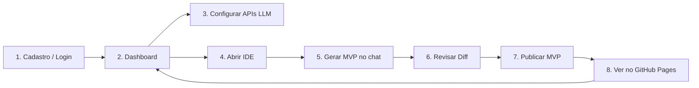
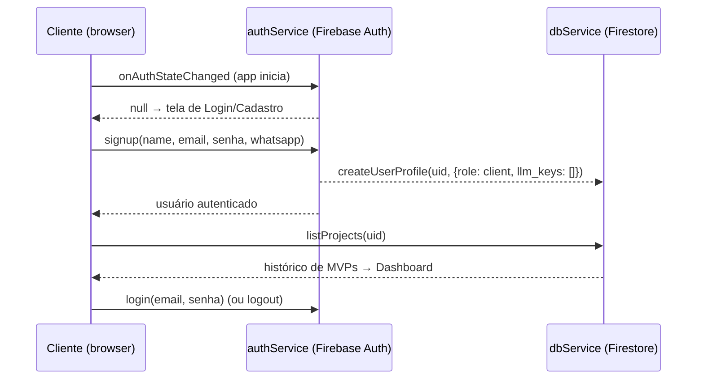
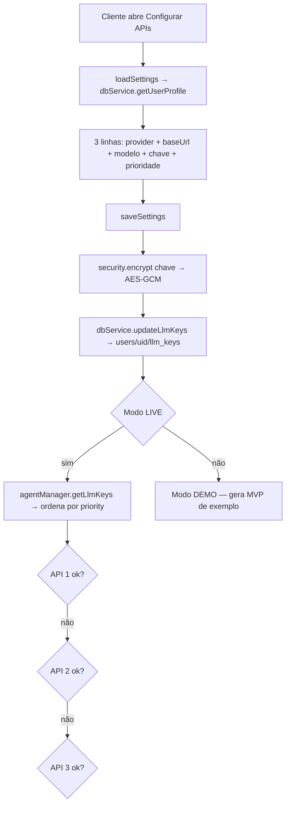
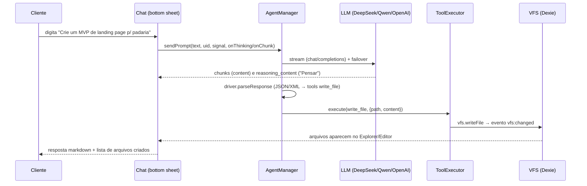
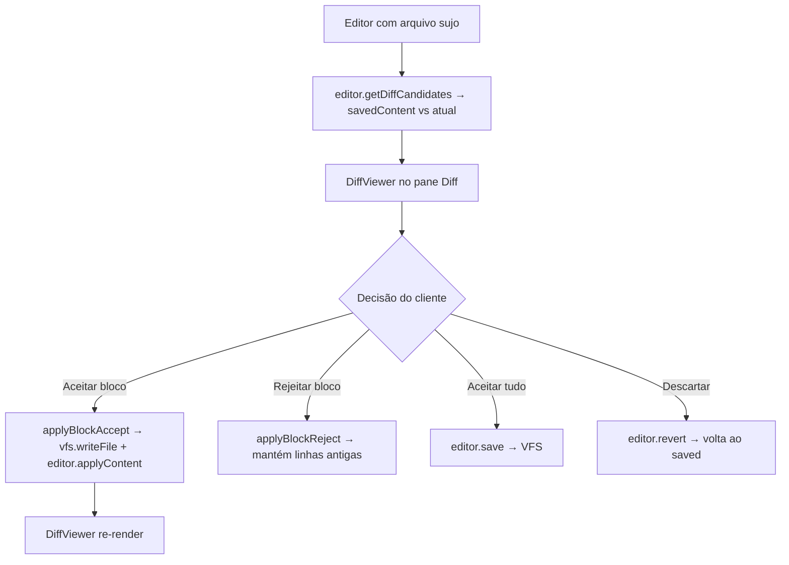
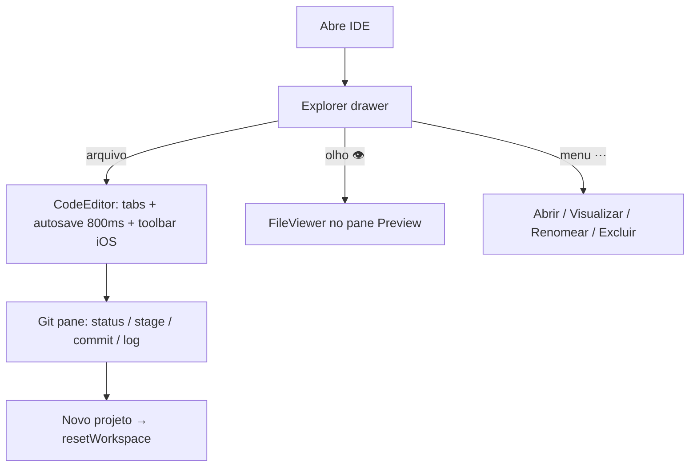
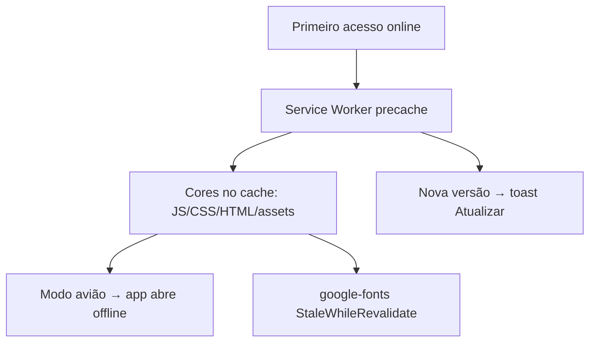

# CAIM — Jornada do Cliente (MVP Factory)

> Mapeamento completo dos fluxos na perspectiva do cliente. As **sprints de homologação (S13–S19)** que testam cada fluxo estão em `../implementation.md` (Fase 5).
> Legenda: ✅ implementado · 🔒 depende de ação do Owner (secret/seed) · 🔮 futuro

---

## J0 — Visão Macro da Jornada



**Lógica de negócio:** o cliente usa as **próprias chaves de LLM** para gerar o código; o deploy acontece na **conta do Owner** via Cloud Function (PAT do Owner nunca sai do Secret Manager). O cliente só vê o resultado (URL + histórico no dashboard).

---

## J1 — Autenticação & Onboarding (auth-gate)



**Rota de segurança:** `firestore.rules` garante `users/{uid}` só o dono; `config/{key}` (cofre) só `role == 'owner'`.

---

## J2 — Configuração de APIs de LLM (failover)



**Regras:** até 3 chaves ativas; failover em 401/429/5xx (backoff 1,2s em 429/5xx); timeout 120s; "Parar" aborta o fetch. **S14 (16/08):** reabrir Configurações preserva as chaves cifradas sem redigitar; chaves nunca em texto puro (AES-GCM); coberto por testes (`agent-manager.test.js`, `auth-views.test.js`).

---

## J3 — Geração do MVP (chat → agente → arquivos)



**Contexto (S7):** `editor.getOpenFilesContext()` injeta até 3 arquivos abertos no system prompt (cap 8KB). Histórico do chat persiste no VFS (60 msgs).
**Truncamento (S15):** se o modelo cortar a resposta no meio de uma tool call (limite de tokens), o parser **salva o arquivo parcial** e o chat exibe "⚠ Resposta truncada — reenvie o prompt" (`detectTruncation` — testes verdes, 16/08).
**Failover (S14):** chave 1 com 401 → cai na 2; chave 2 com 429 → backoff → cai na 3; chave desativada é ignorada (`getLlmKeys` filtra `active`).

---

## J4 — Revisão (Diff)



**Filtro:** `.min.*`/`.map` ignorados (`isMinifiedFile`).

---

## J5 — Publicar MVP (deploy via Cloud Function)

```mermaid
flowchart TD
    C[Cliente clica Deploy no header ou no Git pane] --> P[deployProject]
    P --> T[authService.getIdToken]
    P --> F[empacota VFS: files path+content]
    P --> CF[POST githubDeployProxy + Bearer token]

    subgraph CloudFunction ["githubDeployProxy (conta do Owner)"]
        V[verifyIdToken] --> S[Secret Manager → GITHUB_OWNER_PAT]
        S --> O[octokit: cria repo mvp-<data>-<rand>]
        O --> G[git: blobs → tree → commit → main]
        G --> PG[createPagesSite branch main]
    end

    CF --> R[URL https://owner.github.io/<repo>]
    R --> DB[dbService.addProject → projects/{uid}]
    R --> TO[Toast + botão Abrir]
    DB --> DASH[Dashboard lista o MVP]
```

**Regra de ouro:** o PAT do Owner **nunca** existe no frontend; tudo passa pela CF autenticada com o ID token do cliente.
**Hardening (16/08):** `gitCorsProxy` com **host-allowlist** (só GitHub) + **rate limit 50 req/min** por uid autenticado ou IP — **DEPLOYADO** (verificado: GitHub → 200, host externo → 403).

---

## J6 — Uso da IDE (explorer / editor / preview / git)



**Viewer:** md/img/html/pdf/csv/docx/xlsx/pptx (libs lazy; xlsx/docx sanitizados com DOMPurify — S18). **Git offline:** `init/add/commit/log` 100% local (coberto por teste, 16/08). **CSP/security headers** ativos no Hosting (S18).

---

## J7 — Offline & PWA (modo avião)



**Bundle (S10):** core eager **~156KB gzip** + CSS 5,6KB (F7 removido, CodeMirror minimal). Lazy: xlsx/mammoth/isomorphic-git/marked/DOMPurify/firebase. **Fonte pixel** (Press Start 2P) carregada fora do caminho crítico de render + `preload` do icon (S12/S17). **CSP/security headers** ativos em https://caim.web.app (S18/S19).

---

## Matriz Workflow × Sprint de Homologação

| # | Workflow                    | Fluxos testados                    | Sprint | Cobertura automatizada (16/08) |
|---|-----------------------------|------------------------------------|--------|--------------------------------|
| J1 | Autenticação & Onboarding   | signup, login, rules, seed owner   | S13    | VFS + auth-gate (boot sem flash) |
| J2 | Config de APIs              | 3 chaves, prioridade, failover     | S14    | 🧪 `auth-views` + `agent-manager` (failover/cifragem/persistência) |
| J3 | Geração do MVP              | chat→agente→LLM→arquivos           | S15    | 🧪 `agent-manager` (streaming/thinking/truncamento/contexto/abort) + `tool-executor` |
| J4 | Revisão (Diff)              | aceitar/rejeitar, minified          | S15    | 🧪 `diff-viewer` (blocos aceitar/rejeitar, minified, CRLF) |
| J5 | Publicar MVP                | CF deploy, Pages, Firestore         | S16    | 🧪 `git-service` offline · proxy ao vivo (GitHub 200 / host externo 403) |
| J6 | Uso da IDE                  | explorer/editor/viewer/git          | S16    | 🧪 `file-tree` + `viewer` + `git-service` |
| J7 | Offline & PWA               | modo avião, bundle, atualização     | S17    | bundle 156KB gzip + SW precache verificados |
| -  | Segurança & Go Live         | App Check, Lighthouse, iPhones      | S18–S19 | 🧪 viewer XSS + path traversal + CSP/headers ao vivo · ⏳ device real |
| -  | Correções (auditoria)       | auth, APIs, geração, diff, deploy, offline, segurança | S20–S26 | ⏳ planejado (Fase 6) — ver `../implementation.md` |

> **Fase 6 (S20–S26):** correções da auditoria cruzada `journey.md` × `workflows.md` executada em 16/08/2026 — gaps de produção em auth (senha/email/token), APIs (validação/failover UX), geração (contexto 16KB/continue-truncation), diff (create/delete/rename), deploy (polling Pages/export ZIP/push pendente), offline (storage pressure) e segurança (pdf.js/rate limit dinâmico). Detalhes em `../implementation.md`.
>
> **Fase 7 (S27–S30):** **Retrofit 16-bit** conforme `../layout.md` — estética retro gamificada (fontes pixel, activity bar menu RPG, bottom sheet dialog box, editor CodeMirror 16-bit, explorer inventário, partículas, toasts de conquista, diff batalha, chat terminal, ícones pixel). Visual, não bloqueia o Go Live.
