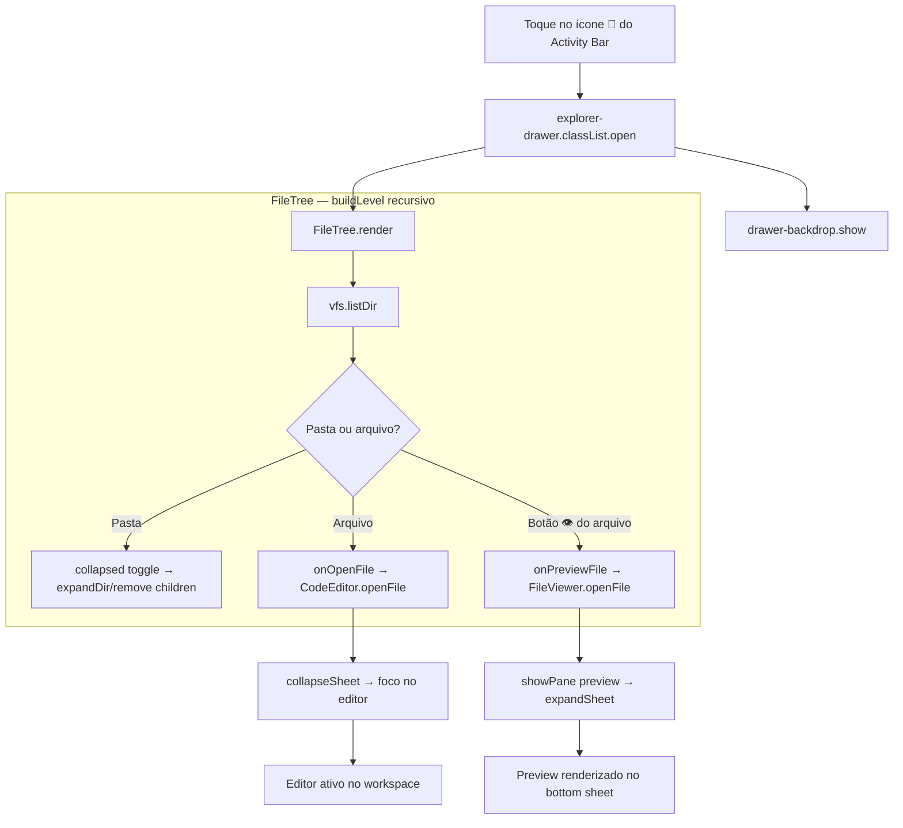
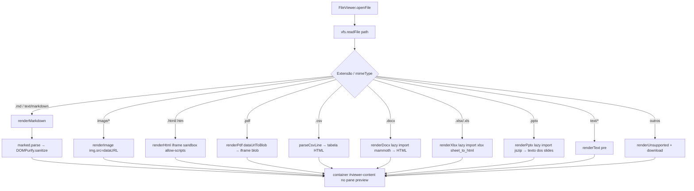
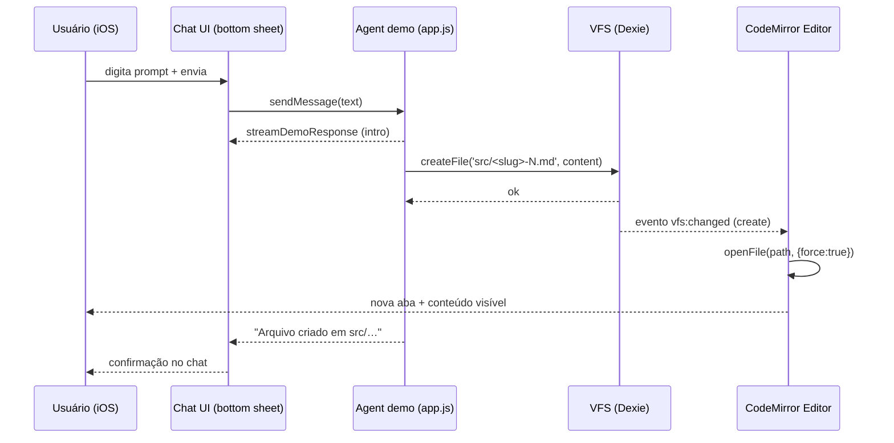
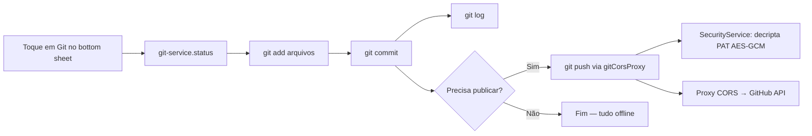
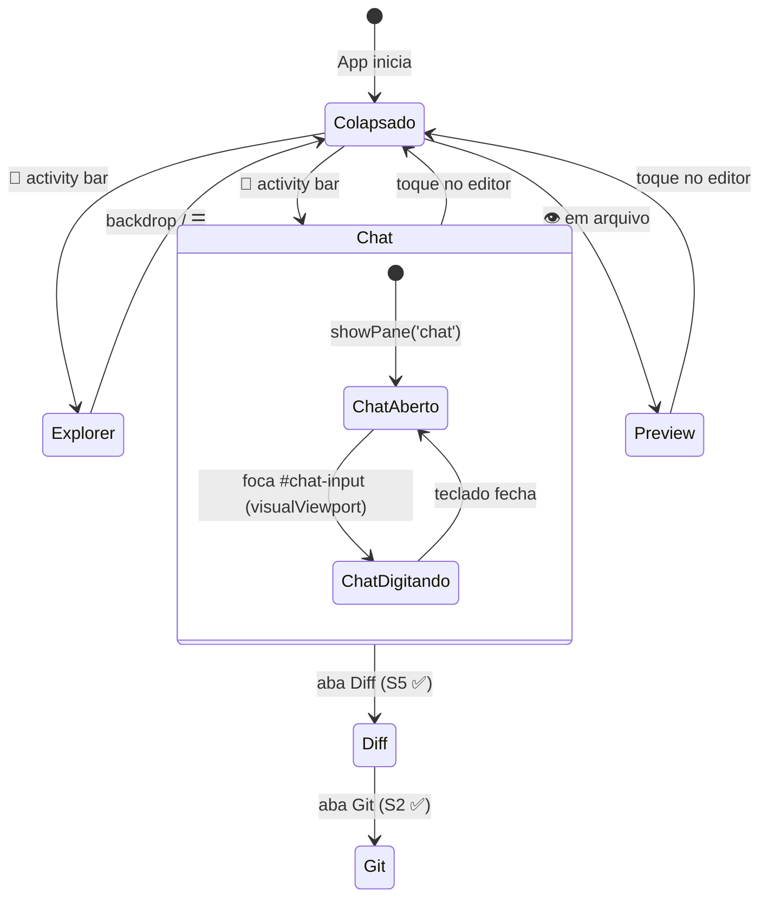

# CAIM — Workflows de Usuário (Mermaid)

> Diagramas dos fluxos de usuário do CAIM. Nomes reais de funções/componentes do código.
> Legenda: ✅ implementado · 🧪 coberto por teste automatizado (Vitest) · ⏳ manual/device real.
> **Sprint de homologação de cada workflow:** `../diagrams/journey.md` (J1–J7) e `../implementation.md` (S13–S19).

---

## 1. Ciclo do Agente — prompt → arquivo → editor

**Explicação técnica:** o usuário digita o prompt no chat (`#chat-input`) e `app.js:sendMessage` exibe a mensagem e chama `agentManager.sendPrompt`. Em **modo LIVE** (S14): streaming SSE da LLM → `driver.parseResponse` (JSON/XML) → `toolExecutor.execute('write_file')` → `vfs.writeFile`. Em **modo DEMO**: `demoSend` gera arquivos de exemplo. O `EventEmitter` emite `vfs:changed` (tipo `create`), e o `CodeEditor.openFile(path, { force: true })` abre a nova aba automaticamente. O chat vive no **bottom sheet** e o editor permanece visível — o ciclo inteiro acontece sem troca de tela.
> 🧪 Coberto por: `agent-manager.test.js` (streaming/thinking/truncamento/contexto/abort), `tool-executor.test.js`, `vfs-service.test.js`, `drivers.test.js`.

```mermaid
flowchart TD
    %% Ciclo central: o prompt gera um arquivo que aparece no editor
    U[Usuário digita o prompt no Chat] -->|bottom sheet expandido| S[app.js: sendMessage]
    S --> M[addMessage user + received]
    M --> R{agentManager.mode}
    R -- LIVE --> L[streaming SSE + failover multi-API]
    L --> P[driver.parseResponse JSON/XML → tools write_file]
    R -- DEMO --> D[demoSend gera arquivos de exemplo]
    P --> C[toolExecutor.execute write_file]
    D --> C
    C -->|path válido + sem .git| V[vfs.writeFile]

    subgraph VFS ["VFS (Dexie)"]
        V --> DB[(IndexedDB: files)]
        DB --> E[EventEmitter: vfs:changed create]
    end

    E --> ED[CodeEditor.openFile force]

    subgraph Editor ["Editor (CodeMirror 6)"]
        ED --> TABS[Aba nova no topo do workspace]
        TABS --> L2[languageFor → extensão]
    end

    L2 --> D2{Usuário satisfeito?}
    D2 -- Não -->|edita e autosave 800ms| E2[markDirty → scheduleSave → vfs.writeFile]
    E2 --> TABS
    D2 -- Sim --> G[Diff/Commit — S5/S2 ✅]
```

---

## 2. Navegação de Arquivos — Explorer drawer

**Explicação técnica:** toque em 📁 no **Activity Bar** abre o `explorer-drawer` (classe `.open`, `translateX(-100%) → 0`) com backdrop. Dentro, `FileTree.render` monta a árvore recursiva via `vfs.listDir`. Pasta = `collapsed` Set (expandir/recolher); arquivo = `onOpenFile` (abre no editor e recolhe o sheet); botão 👁 = `onPreviewFile` (abre o viewer no pane `preview`). * Layout S4.5.*
> 🧪 Coberto por: `file-tree.test.js` (árvore, `.git` oculto, abrir/preview/⋯, expandir/recolher, XSS no nome).



---

## 3. Pré-visualização de Arquivos — roteador de formatos

**Explicação técnica:** `FileViewer.openFile` lê `vfs.readFile` (conteúdo + mimeType) e delega para o renderer da extensão. Textos/Markdown renderizam direto; binários (imagem, PDF, DOCX, XLSX, PPTX) via **data URL** → `dataUrlToBlob`. DOCX/XLSX/PPTX usam **lazy-load** (`import('mammoth'/'xlsx'/'jszip')`) — só baixam quando esse formato é aberto. Markdown/CSV/XLSX/DOCX são **sanitizados** (DOMPurify / textContent) — ver S18.
> 🧪 Coberto por: `viewer.test.js` (XSS em markdown/csv/html/xlsx/docx/texto).



---

## 4. Sequência — chat → VFS → editor (fluxo temporal)

**Explicação técnica:** visão cronológica do ciclo do agente. O streaming (demo) roda no chat do bottom sheet enquanto o arquivo é criado no VFS e aberto no editor — com a S4.5, **nenhuma dessas etapas troca de tela**. Em modo LIVE o fluxo é o mesmo, porém o agente consome a LLM via streaming SSE (S14).



---

## 5. Git (implementado — S2) 

**Explicação técnica:** fluxo no pane `git` do bottom sheet. `git-service.js` (isomorphic-git + `gitFs`/VFS adapter) roda `init/add/commit/log` **100% offline**; `gitFs` calcula `stat` por **hash de conteúdo** (edição no mesmo segundo não passa despercebida). `push` decriptografa o PAT (Web Crypto) apenas na hora da rede via `gitCorsProxy` (host-allowlist GitHub + rate limit 50 req/min — **DEPLOYADO** 16/08).
> 🧪 Coberto por: `git-service.test.js` (init/add/commit/log/status/remotes) + `vfs-fs` via esses testes.
> ⏳ Manual/device real: push real para o GitHub via proxy.



---

## 6. Layout IDE — estados da tela (S4.5 ✅)

**Explicação técnica:** a tela nunca "troca de página". Activity Bar alterna entre drawer (Explorer) e panes do bottom sheet (Chat/Diff/Preview/Git); o editor central permanece montado o tempo todo. Altura do sheet: `44px` recolhido ↔ `80% do visualViewport` expandido; `syncViewport` com throttle `requestAnimationFrame` evita jitter do teclado iOS (padrão viewport-truth).
> 🧪 Coberto por: `diff-viewer.test.js` (blocos aceitar/rejeitar + minified). Layout em si validado manualmente (device real ⏳).



---

> **Exportação:** diagramas renderizáveis nativamente no GitHub e no VS Code (bloco ` ```mermaid `). Revisar em: `https://mermaid.live/`.
