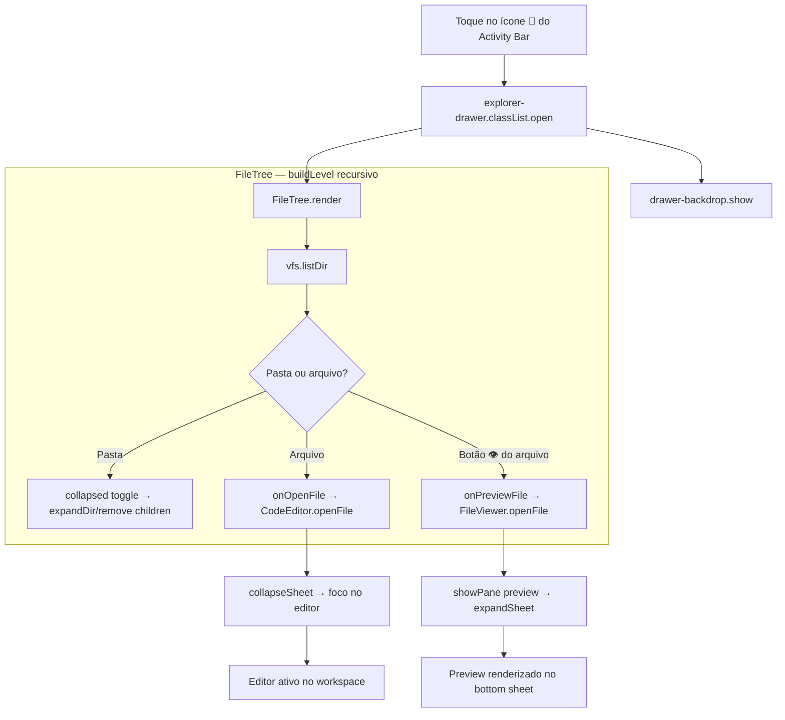
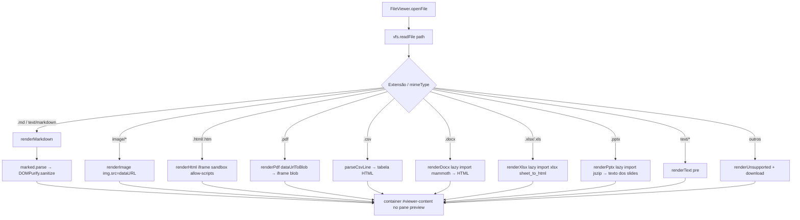
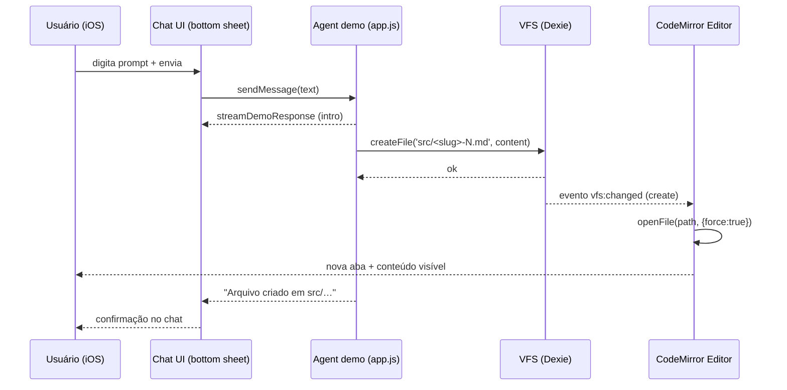
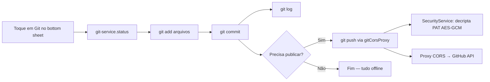
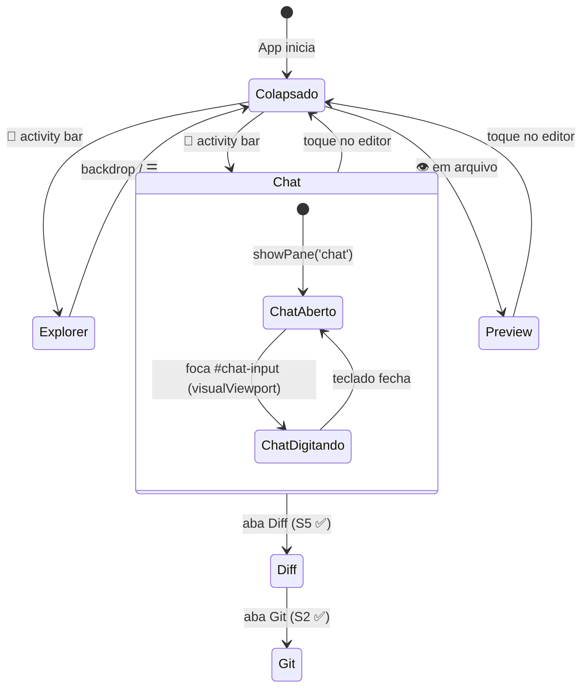
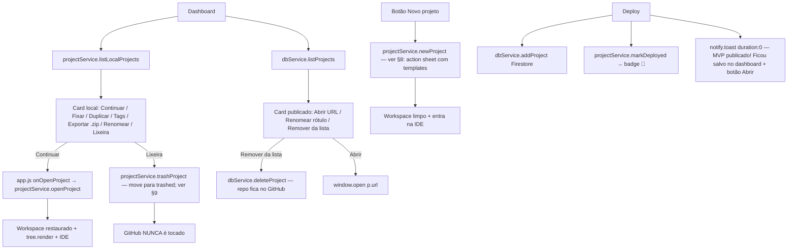
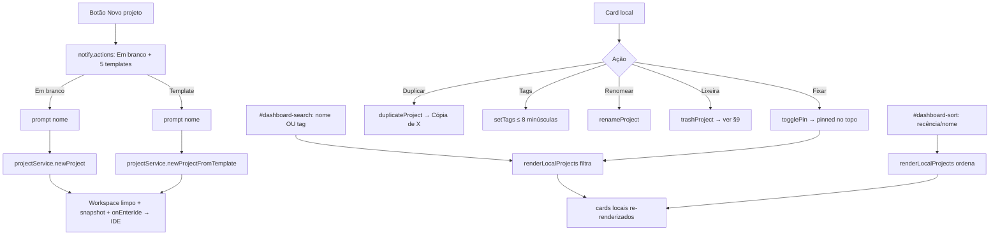
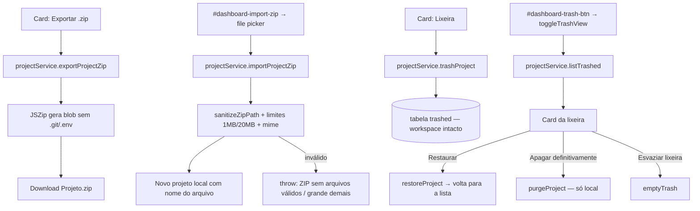
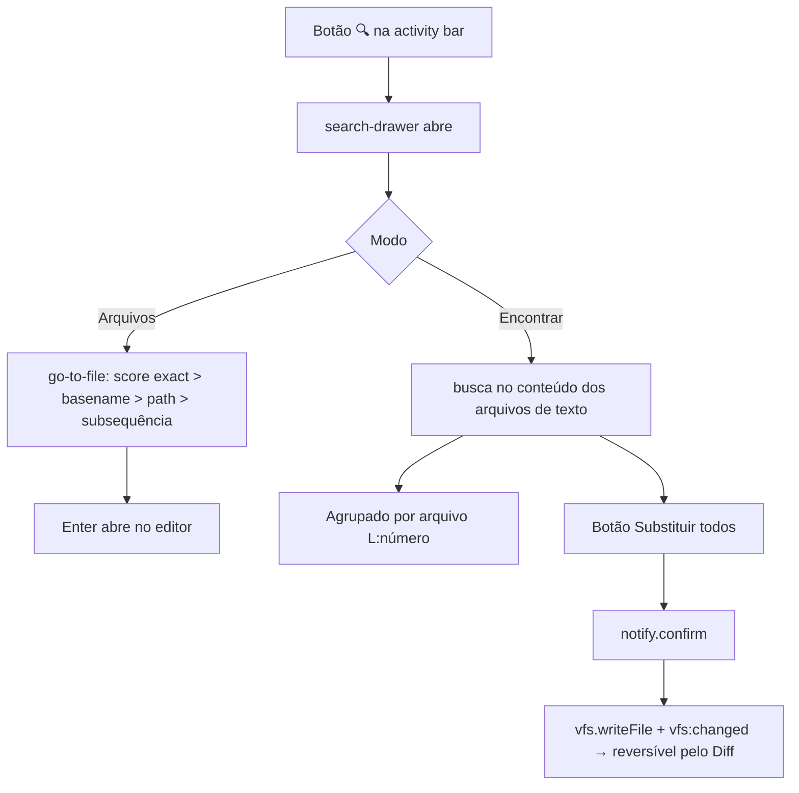
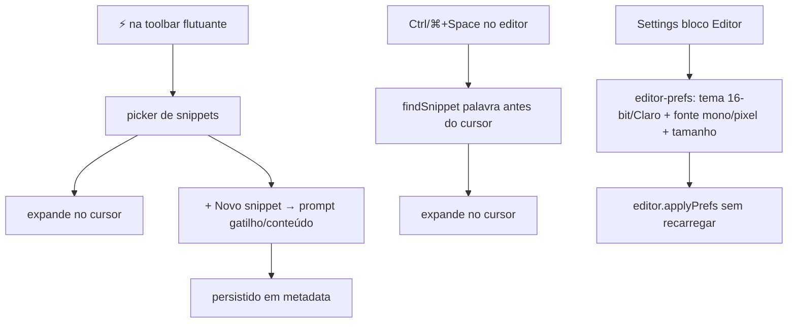

# CAIM — Workflows de Usuário (Mermaid)

> Diagramas dos fluxos de usuário do CAIM. Nomes reais de funções/componentes do código.
> Legenda: ✅ implementado · 🧪 coberto por teste automatizado (Vitest) · ⏳ manual/device real.
> **Sprint de homologação de cada workflow:** `../diagrams/journey.md` (J1–J7) e `../implementation.md` (S13–S19 core; S36–S42 gestor de projetos/dashboard/autonomia).

---

## 1. Ciclo do Agente — prompt → arquivo → editor

**Explicação técnica:** o usuário digita o prompt no chat (`#chat-input`) e `app.js:sendMessage` exibe a mensagem e chama `agentManager.sendPrompt`. Em **modo LIVE** (S14): streaming SSE da LLM → `driver.parseResponse` (JSON/XML) → `toolExecutor.execute('write_file')` → `vfs.writeFile`. Em **modo DEMO**: `demoSend` gera arquivos de exemplo. O `EventEmitter` emite `vfs:changed` (tipo `create`), e o `CodeEditor.openFile(path, { force: true })` abre a nova aba automaticamente. O chat vive no **bottom sheet** e o editor permanece visível — o ciclo inteiro acontece sem troca de tela.
> 🧪 Coberto por: `agent-manager.test.js` (streaming/thinking/truncamento/contexto/abort), `tool-executor.test.js`, `vfs-service.test.js`, `drivers.test.js`.

```mermaid
flowchart TD
    %% Ciclo central: o prompt gera um arquivo que aparece no editor
    U[Usuário digita o prompt no Chat] -->|bottom sheet expandido| S[app.js: sendMessage]
    S --> M[addMessage user + received]
    M --> R{agentManager.mode}
    R -- LIVE --> L[streaming SSE + failover multi-API]
    L --> P[driver.parseResponse JSON/XML → tools write_file]
    R -- DEMO --> D[demoSend gera arquivos de exemplo]
    P --> C[toolExecutor.execute write_file]
    D --> C
    C -->|path válido + sem .git| V[vfs.writeFile]

    subgraph VFS ["VFS (Dexie)"]
        V --> DB[(IndexedDB: files)]
        DB --> E[EventEmitter: vfs:changed create]
    end

    E --> ED[CodeEditor.openFile force]

    subgraph Editor ["Editor (CodeMirror 6)"]
        ED --> TABS[Aba nova no topo do workspace]
        TABS --> L2[languageFor → extensão]
    end

    L2 --> D2{Usuário satisfeito?}
    D2 -- Não -->|edita e autosave 800ms| E2[markDirty → scheduleSave → vfs.writeFile]
    E2 --> TABS
    D2 -- Sim --> G[Diff/Commit — S5/S2 ✅]
```

---

## 2. Navegação de Arquivos — Explorer drawer

**Explicação técnica:** toque em 📁 no **Activity Bar** abre o `explorer-drawer` (classe `.open`, `translateX(-100%) → 0`) com backdrop. Dentro, `FileTree.render` monta a árvore recursiva via `vfs.listDir`. Pasta = `collapsed` Set (expandir/recolher); arquivo = `onOpenFile` (abre no editor e recolhe o sheet); botão 👁 = `onPreviewFile` (abre o viewer no pane `preview`). **Ícones por tipo de arquivo (S37):** `file-icons.js` escolhe SVG lucide por extensão (`ft-icon-*`) — html/css/js/ts/json/md/img/pdf/doc/xls/ppt/zip/txt/py, `.gitignore`→git, dotfiles→config, fallback genérico. * Layout S4.5.*
> 🧪 Coberto por: `file-tree.test.js` (árvore, `.git` oculto, abrir/preview/⋯, expandir/recolher, XSS no nome, ícones por extensão).



---

## 3. Pré-visualização de Arquivos — roteador de formatos

**Explicação técnica:** `FileViewer.openFile` lê `vfs.readFile` (conteúdo + mimeType) e delega para o renderer da extensão. Textos/Markdown renderizam direto; binários (imagem, PDF, DOCX, XLSX, PPTX) via **data URL** → `dataUrlToBlob`. DOCX/XLSX/PPTX usam **lazy-load** (`import('mammoth'/'xlsx'/'jszip')`) — só baixam quando esse formato é aberto. Markdown/CSV/XLSX/DOCX são **sanitizados** (DOMPurify / textContent) — ver S18.
> 🧪 Coberto por: `viewer.test.js` (XSS em markdown/csv/html/xlsx/docx/texto).



---

## 4. Sequência — chat → VFS → editor (fluxo temporal)

**Explicação técnica:** visão cronológica do ciclo do agente. O streaming (demo) roda no chat do bottom sheet enquanto o arquivo é criado no VFS e aberto no editor — com a S4.5, **nenhuma dessas etapas troca de tela**. Em modo LIVE o fluxo é o mesmo, porém o agente consome a LLM via streaming SSE (S14).



---

## 5. Git (implementado — S2) 

**Explicação técnica:** fluxo no pane `git` do bottom sheet. `git-service.js` (isomorphic-git + `gitFs`/VFS adapter) roda `init/add/commit/log` **100% offline**; `gitFs` calcula `stat` por **hash de conteúdo** (edição no mesmo segundo não passa despercebida). `push` decriptografa o PAT (Web Crypto) apenas na hora da rede via `gitCorsProxy` (host-allowlist GitHub + rate limit 50 req/min — **DEPLOYADO** 16/08).
> 🧪 Coberto por: `git-service.test.js` (init/add/commit/log/status/remotes) + `vfs-fs` via esses testes.
> ⏳ Manual/device real: push real para o GitHub via proxy.



---

## 6. Layout IDE — estados da tela (S4.5 ✅)

**Explicação técnica:** a tela nunca "troca de página". Activity Bar alterna entre drawer (Explorer) e panes do bottom sheet (Chat/Diff/Preview/Git); o editor central permanece montado o tempo todo. Altura do sheet: `44px` recolhido ↔ `80% do visualViewport` expandido; `syncViewport` com throttle `requestAnimationFrame` evita jitter do teclado iOS (padrão viewport-truth).
> 🧪 Coberto por: `diff-viewer.test.js` (blocos aceitar/rejeitar + minified). Layout em si validado manualmente (device real ⏳).



---

## 7. Gestor de Projetos — dashboard (S36 ✅) e Deploy com toast persistente (S36b ✅)

**Explicação técnica:** o dashboard (`auth-views.js:renderDashboard`) agora tem duas seções. **Projetos locais** (`projectService.listLocalProjects()` — snapshots no Dexie v2/v3, tabelas `projects`/`project_files`): ações **Continuar** (`onOpenProject(id)` → `openProject` restaura o snapshot no workspace, `tree.render()` + chat recarregados, `authViews.show('ide')`), **Fixar/Duplicar/Tags/Exportar .zip/Renomear/Lixeira** (S40/S41 — ver §8 e §9). **Publicados no GitHub** (`dbService.listProjects(uid)` — Firestore): card com URL clicável, **Renomear rótulo** (`dbService.renameProject`, só o `name` no Firestore) e **Remover da lista** (`dbService.deleteProject` — o repo no GitHub fica intacto). Botão **"Novo projeto"** (`projectService.newProject`) hoje abre um **action sheet com "Em branco" + 5 templates** (S40 — ver §8).

**Deploy (S36b):** após `githubDeployProxy` responder, o app grava `dbService.addProject` (Firestore) + `projectService.saveProjectSnapshot`/`markDeployed` (badge "🚀 publicado" no card local); o `notify.toast` com `duration: 0` fica **persistente** ("MVP publicado! Ficou salvo no dashboard." + botão **"Abrir"**). O toast "construindo" é fechado explicitamente (`buildingToast.close()`) quando `waitForPagesLive` vê o site online. O `404` no console durante o build é o `HEAD` do polling — esperado.
> 🧪 Coberto por: `project-service.test.js`, `auth-views.test.js` (gestor de projetos) e `notify.test.js` (toast `duration:0`/botão).



---

## 8. Dashboard — Templates, Duplicar, Pin/Tags e Busca/Ordenação (S40 ✅)

**Explicação técnica:** o botão **"Novo projeto"** (`auth-views.js:newProject`) abre um **action sheet** (`notify.actions` com `title`/`subtext`) com **"Em branco"** + os **5 templates** de `projectService.PROJECT_TEMPLATES` (HTML/CSS/JS puro, React via CDN, Python, Markdown doc, Currículo 16-bit). Escolher um template → `newProjectPrompt(template)` pede o nome e chama `newProjectFromTemplate(name, template.id)` (limpa o workspace, grava os arquivos e faz snapshot); "Em branco" → `newProject(name)`. No **card local** as ações são: **Fixar** (`togglePin` — `pinned` sobe no topo da listagem), **Duplicar** (`duplicateProject` → "Cópia de X", id único, nunca toca o original nem o workspace), **Tags** (`setTags` — normaliza minúsculas, sem duplicadas, máx. 8), **Renomear** (`renameProject`). **Busca** (`#dashboard-search`) filtra por **nome ou tag** (case-insensitive) e **ordenação** (`#dashboard-sort`) por **recência/nome**, ambos só no cliente (`renderLocalProjects`).
> 🧪 Coberto por: `project-service.test.js` (templates/duplicate/pin/tags) + `auth-views.test.js` (busca/ordenação/pin do dashboard).



---

## 9. Projeto em `.zip` e Lixeira (S41 ✅)

**Explicação técnica:** **Exportar .zip** (`exportProjectZip(id)`) empacota o snapshot com JSZip (ignora `.git`/`.env`) e baixa `Projeto.zip`. **Importar .zip** (`#dashboard-import-zip` → `importProjectZip(file, name)`) valida com `sanitizeZipPath` (rejeita `..`, absolutos, drive), limites **1MB/arquivo** e **20MB total**, resolve mime, e cria **novo projeto local** com o nome do arquivo — **nunca toca o workspace atual**. **Lixeira:** `trashProject(id)` **move** o projeto para a tabela `trashed` (VFS v3) — não apaga, workspace intacto, desmarca o ativo; `#dashboard-trash-btn` → `toggleTrashView()` lista (`listTrashed`, mais recente primeiro) com **Restaurar** (`restoreProject` → volta à lista com arquivos), **Apagar definitivamente** (`purgeProject`) e **Esvaziar lixeira** (`emptyTrash`) — tudo só local, o GitHub nunca é tocado.
> 🧪 Coberto por: `project-service.test.js` (zip round-trip, paths perigosos, limites, trash/restore/purge/empty) + `auth-views.test.js` (UI da lixeira).



---

## 10. Autonomia do Agente — permissões, planos e undo (S42 ✅)

**Explicação técnica:** o **toggle de permissão** (`.perm-toggle`) no header do chat alterna entre `PERMISSION.ASK` (responde com **plano** sem executar), `REVIEW` (executa e mostra no Diff — padrão) e `AUTO` (executa sem pedir, logado no chat). A permissão é **por projeto** (`setPermissionForProject`/`loadPermission` — metadata `agent-permission:<id>`; `openIde` carrega e chama `syncPermButtons`). Em modo `ask`, `sendMessage` recebe `{ plan: { message, tools, filesList } }` e `renderPlanChecklist` desenha o checklist no chat com **"Aprovar tudo"** (`runPlanAll` → `executePlan`) e **"Aprovar passo"** (`runPlanStep` → `executePlan({ only })`). Cada tool call grava `before`/`after` em `undoStack` (resetado por `beginUndo()`); o botão **"Reverter alteração da IA"** (`undoLastPlan`) restaura o conteúdo **byte a byte** ou remove arquivos que não existiam. Em `review`/`auto` o fluxo é o mesmo, porém as tools rodam **inline** e o `vfs:changed` em AUTO aplica sem diálogo de conflito.
> 🧪 Coberto por: `agent-manager.test.js` (gate `ask` bloqueia tool sem aprovação; `auto`/`review` inline; `executePlan` tudo/passo; `undoLastPlan` restaura/remove; permissão persistida em metadata).

```mermaid
flowchart TD
    PT[Perm toggle no header do chat] --> PM{Modo}
    PM -- ask --> ASK[loadPermission → ask]
    PM -- review --> RV[review — executa e mostra no Diff]
    PM -- auto --> AU[auto — executa sem pedir]

    S2[Usuário envia prompt] --> AG[agentManager.sendPrompt]
    AG -- ask --> PLAN[{ plan: message + tools + filesList }]
    PLAN --> CHK[renderPlanChecklist no chat]
    CHK --> AP[Aprovar tudo → executePlan]
    CHK --> APS[Aprovar passo → executePlan {only}]
    AP --> EX[executeTools → vfs + Diff]
    APS --> EX
    AG -- review/auto --> EXI[executeTools inline → vfs + Diff]
    EX --> UNDO[Reverter alteração da IA → undoLastPlan]
    EXI --> UNDO
    UNDO --> UL[restaura byte a byte / remove arquivos novos]
```

---

## 11. Busca global — go-to-file & Find/Replace (S38 ✅)

**Explicação técnica:** o botão **🔍** na activity bar abre o **search drawer** (`search-panel.js`). Modo **Arquivos**: `go-to-file` pontua candidatos (`exact > basename > path > subsequência`) e **Enter** abre no editor. Modo **Encontrar**: busca no conteúdo de todos os arquivos de texto (ignora `.git/`, binários e data URLs), agrupada por arquivo com `L:número`; **"Substituir todos"** pede confirmação (`notify.confirm`), grava via `vfs.writeFile`, emite `vfs:changed` e é **reversível pelo Diff**.
> 🧪 Coberto por: `search-panel.test.js` (score/abrir, agrupamento, substituir todos, XSS).



---

## 12. Editor avançado — snippets, tema e prefs (S39 ✅)

**Explicação técnica:** o botão **⚡ na toolbar flutuante iOS** abre o picker de **snippets** (`snippets.js`) e expande no cursor; **Ctrl/⌘+Space** no editor resolve a palavra antes do cursor via `findSnippet` (prefixo `!` para custom, `*` para todas as linguagens). O picker também tem **"＋ Novo snippet"** (prompt gatilho/conteúdo, persistido em metadata). O bloco **"Editor"** no Settings (`editor-prefs.js`) salva **tema** (16-bit padrão / Claro), **fonte** (mono/pixel) e **tamanho** em metadata; `editor.applyPrefs` aplica via compartments sem recarregar.
> 🧪 Coberto por: `snippets.test.js`, `editor-prefs.test.js` e `editor.test.js`.



---

> **Exportação:** diagramas renderizáveis nativamente no GitHub e no VS Code (bloco ` ```mermaid `). Revisar em: `https://mermaid.live/`.
