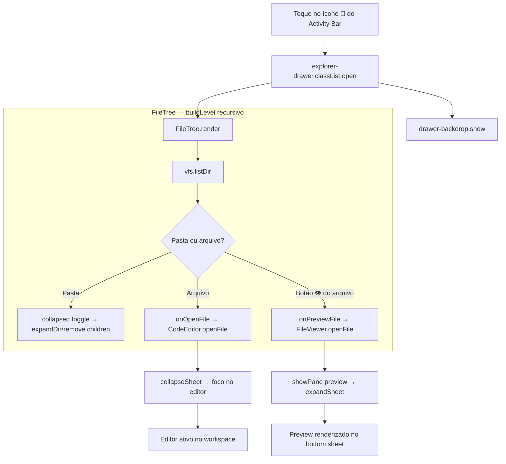
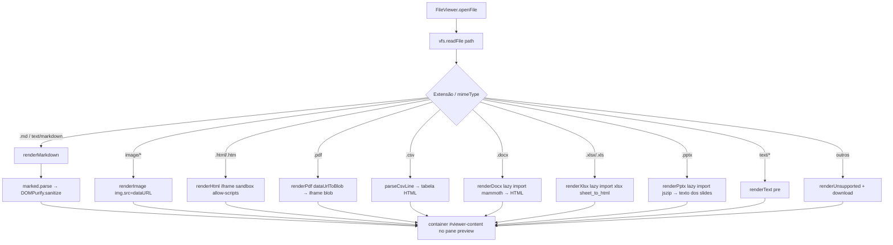
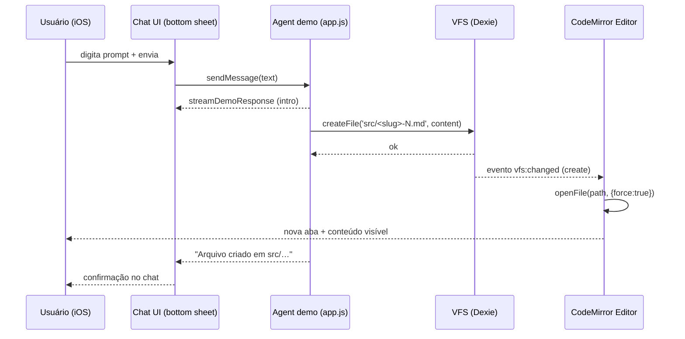
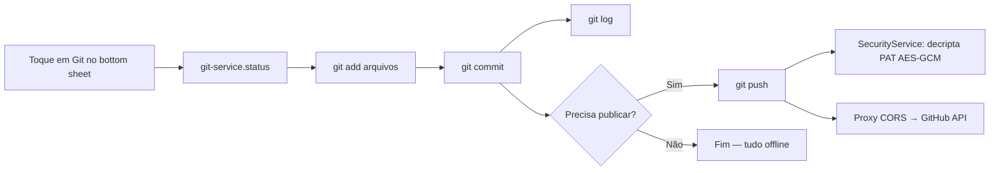
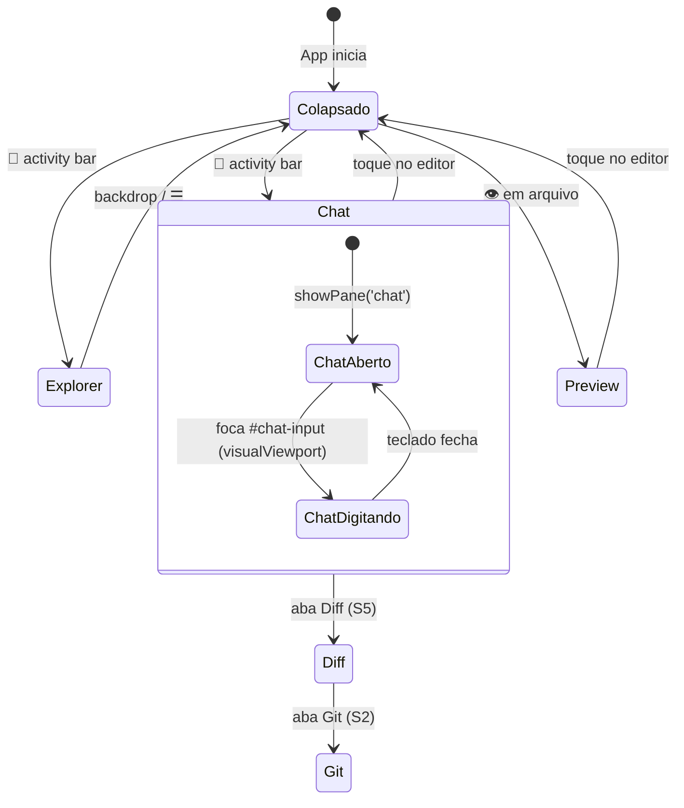

# CAIM — Workflows de Usuário (Mermaid)

> Diagramas dos fluxos de usuário do CAIM. Nomes reais de funções/componentes do código.
> Legenda: ✅ implementado · S4.5 = layout aprovado · S2 = planejado.

---

## 1. Ciclo do Agente — prompt → arquivo → editor

**Explicação técnica:** o usuário digita o prompt no chat (`#chat-input`) e `app.js:sendMessage` exibe a mensagem, dispara `streamDemoResponse` e chama `agentCreatesFile`, que gera `src/<slug>-N.md` e grava via `vfs.createFile`. O `EventEmitter` emite `vfs:changed` (tipo `create`), e o `CodeEditor.openFile(path, { force: true })` abre a nova aba automaticamente. Com a S4.5, o chat vive no **bottom sheet** e o editor permanece visível — o ciclo inteiro acontece sem troca de tela.

```mermaid
flowchart TD
    %% Ciclo central: o prompt gera um arquivo que aparece no editor
    U[Usuário digita o prompt no Chat] -->|bottom sheet expandido| S[app.js: sendMessage]
    S --> M[addMessage user + received]
    M --> R[streamDemoResponse]
    R -->|streama intro| C[agentCreatesFile]
    C -->|slugify prompt → src/&lt;slug&gt;-N.md| V[vfs.createFile]

    subgraph VFS ["VFS (Dexie)"]
        V --> DB[(IndexedDB: files)]
        DB --> E[EventEmitter: vfs:changed create]
    end

    E --> ED[CodeEditor.openFile force]

    subgraph Editor ["Editor (CodeMirror 6)"]
        ED --> TABS[Aba nova no topo do workspace]
        TABS --> L[languageFor → extensão]
    end

    L --> D{Usuário satisfeito?}
    D -- Não -->|edita e autosave 800ms| D2[markDirty → scheduleSave → vfs.writeFile]
    D2 --> TABS
    D -- Sim --> G[Diff/Commit — S5/S2 ]
```

---

## 2. Navegação de Arquivos — Explorer drawer

**Explicação técnica:** toque em 📁 no **Activity Bar** abre o `explorer-drawer` (classe `.open`, `translateX(-100%) → 0`) com backdrop. Dentro, `FileTree.render` monta a árvore recursiva via `vfs.listDir`. Pasta = `collapsed` Set (expandir/recolher); arquivo = `onOpenFile` (abre no editor e recolhe o sheet); botão 👁 = `onPreviewFile` (abre o viewer no pane `preview`). * Layout S4.5.*



---

## 3. Pré-visualização de Arquivos — roteador de formatos

**Explicação técnica:** `FileViewer.openFile` lê `vfs.readFile` (conteúdo + mimeType) e delega para o renderer da extensão. Textos/Markdown renderizam direto; binários (imagem, PDF, DOCX, XLSX, PPTX) via **data URL** → `dataUrlToBlob`. DOCX/XLSX/PPTX usam **lazy-load** (`import('mammoth'/'xlsx'/'jszip')`) — só baixam quando esse formato é aberto.



---

## 4. Sequência — chat → VFS → editor (fluxo temporal)

**Explicação técnica:** visão cronológica do ciclo do agente. O streaming (demo) roda no chat do bottom sheet enquanto o arquivo é criado no VFS e aberto no editor — com a S4.5, **nenhuma dessas etapas troca de tela**.



---

## 5. Git (futuro — S2) 

**Explicação técnica:** fluxo planejado no pane `git` do bottom sheet. `git-service.js` (isomorphic-git + lightning-fs) roda `init/add/commit/log` offline; `push` decriptografa o PAT (Web Crypto) apenas na hora da rede via proxy CORS.



---

## 6. Layout IDE — estados da tela (S4.5) 

**Explicação técnica:** a tela nunca "troca de página". Activity Bar alterna entre drawer (Explorer) e panes do bottom sheet (Chat/Diff/Preview/Git); o editor central permanece montado o tempo todo. Altura do sheet: `48px` recolhido ↔ `80% do visualViewport` expandido.



---

> **Exportação:** diagramas renderizáveis nativamente no GitHub e no VS Code (bloco ` ```mermaid `). Revisar em: `https://mermaid.live/`.
